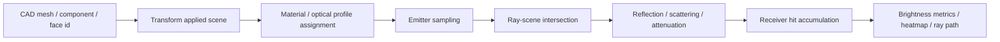

# Ray Tracing 단계적 구현 설계

## 목적
- TV 기구부의 국부적인 빛샘을 빠르게 예측하는 전용 ray tracing 엔진을 만든다.
- LightTools 같은 범용 상용 광학툴의 모든 기능을 복제하지 않는다.
- 대신 `면 광원 → 기구 표면 반사/산란 → gap/receiver 도달 → 밝기 지표` 흐름에 집중한다.
- 초기 구현은 자체 경량 엔진으로 시작하고, 병목이 확인되면 BVH/NumPy/Numba/Open3D 같은 계산 가속만 단계적으로 붙인다.

## 구현 원칙
- 좌표계는 CAD/model 원본 좌표계를 유지한다.
- 길이 단위는 기본적으로 `mm`를 사용한다.
- ray tracing 내부의 면적/거리 광량 계산에서 필요한 경우 `m` 단위로 변환한다.
- V1에서는 분광/색좌표/색온도는 보류한다.
- V1에서는 luminous flux 기반 `lumen` 입력과 receiver 누적량 기반 `nit_est` 추정에 집중한다.
- 실측 절대 휘도 정합은 `k_abs` 보정 상수로 시작한다.

## 왜 자체 구현으로 시작하는가
- 상용/범용 광학 엔진은 emitter, receiver, optical property 설정 자유도가 높지만 빛샘 전용 workflow에는 과하다.
- 현재 프로젝트는 CAD mesh, component id, face id, transform, material assignment를 이미 자체 UI/데이터 계약으로 관리한다.
- 빛샘 판단에 필요한 지표는 `receiver hit`, `누설 경로`, `component contribution`, `before/after delta`처럼 제품 설계 의사결정에 특화되어 있다.
- 따라서 핵심 알고리즘은 직접 구현하고, 성능 가속 라이브러리는 나중에 필요한 위치에만 적용한다.

## 전체 파이프라인



## 핵심 입력 데이터

### 1. Scene geometry
- `mesh.vertices`: `[[x, y, z], ...]`
- `mesh.faces`: `[[v0, v1, v2], ...]`
- `mesh.face_normals`: `[[nx, ny, nz], ...]`
- `mesh.face_component_ids`: `[component_id, ...]`
- `mesh.face_material_ids`: `[material_id, ...]`
- `transforms`: component/local face move/tilt 적용 결과

### 2. Emitter
면 광원 기반을 기본으로 한다.

```json
{
  "emitter_id": "emitter_001",
  "type": "face",
  "face_indices": [120, 121, 122],
  "normal_mode": "face_normal",
  "normal_flip": false,
  "direction_distribution": "lambertian",
  "gaussian_sigma_deg": 12.0,
  "power_lumen": 1.0,
  "ray_count": 10000,
  "seed": 42
}
```

#### Emitter 설정 항목
- `광 방출 방향`
  - 기본: 선택 face normal
  - 옵션: normal flip, 사용자 지정 vector
- `광 방향 분포`
  - `lambertian`: 기본값, 표면 normal 기준 cosine weighted 분포
  - `isotropic`: 전방/공간 균일 분포, 실제성은 낮지만 worst case 검토에 유용
  - `gaussian`: normal 주변에 집중된 분포, 측면 누설 영역의 방향성을 줄 때 사용
- `파워`
  - 사용자 입력 단위: `lumen`
  - ray당 초기 weight: `power_lumen / ray_count`
  - 추후 LED/BLU reference와 연결할 때 scale factor로 보정

### 3. Receiver
V1에서는 rectangular plane receiver를 기본으로 한다.

```json
{
  "receiver_id": "receiver_001",
  "type": "rectangle",
  "center": [260.0, 150.0, 47.5],
  "normal": [0.0, -1.0, 0.0],
  "width_mm": 100.0,
  "height_mm": 30.0,
  "resolution": [80, 24],
  "acceptance_angle_deg": 90.0
}
```

#### Receiver 역할
- 사용자가 보는 방향 또는 관심 gap 출구면에 배치한다.
- ray가 receiver plane과 교차하면 local `(u, v)` 좌표로 binning한다.
- 각 bin에 ray luminous flux 또는 irradiance 유사값을 누적한다.

### 4. Optical property
material library의 `base material + surface property + optional BSDF`를 ray tracing용 optical profile로 변환한다.

```json
{
  "profile_id": "black_pc_matte_default",
  "reflectance": 0.08,
  "absorption": 0.92,
  "specular_ratio": 0.10,
  "diffuse_ratio": 0.90,
  "scatter_model": "lambertian",
  "roughness": 0.65,
  "gaussian_sigma_deg": 18.0
}
```

#### V1 필수 optical property
- `reflectance`: hit 후 남는 총 에너지 비율
- `absorption`: 흡수 비율, 보통 `1 - reflectance`
- `specular_ratio`: 정반사 성분 비율
- `diffuse_ratio`: 산란/확산 성분 비율
- `scatter_model`: `lambertian`, `gaussian`, `none`
- `roughness` 또는 `gaussian_sigma_deg`: 산란 분포 폭

## Ray tracing 알고리즘

### Step 1. 면 광원 sampling
1. emitter face 집합에서 면적 가중치로 triangle을 하나 선택한다.
2. 선택 triangle 내부의 random barycentric coordinate로 ray 시작점을 만든다.
3. ray 시작점은 self intersection 방지를 위해 normal 방향으로 작은 `epsilon`만큼 이동한다.
4. 방향 분포에 따라 ray direction을 생성한다.
5. ray weight를 `power_lumen / ray_count`로 부여한다.

### Step 2. Ray-scene intersection
초기 구현은 Möller-Trumbore ray-triangle intersection을 사용한다.

입력:
- ray origin `O`
- ray direction `D`
- triangle vertices `V0, V1, V2`

출력:
- 가장 가까운 hit distance `t`
- hit face id
- hit point
- barycentric coordinate
- hit normal

V1에서는 brute force로 시작할 수 있으나, 실제 CAD에서는 triangle 수가 커지므로 BVH 가속을 빠르게 붙이는 것을 목표로 한다.

### Step 3. Hit 처리
1. hit face의 component/material/optical profile을 찾는다.
2. 입사각 `cos_theta = max(0, -dot(D, N))`을 계산한다.
3. ray weight를 optical property에 따라 감쇄한다.
4. weight가 threshold 아래면 ray를 종료한다.
5. max depth에 도달하면 ray를 종료한다.

### Step 4. 반사/산란 방향 생성
- Specular:
  - `R = D - 2 * dot(D, N) * N`
- Lambertian:
  - surface normal hemisphere에서 cosine weighted sampling
- Gaussian:
  - specular 또는 normal 방향 주변에 gaussian cone sampling
- Mixed:
  - `specular_ratio` 확률로 specular
  - 나머지는 diffuse/scatter

### Step 5. Receiver 교차 판정
각 bounce 사이의 ray segment에 대해 receiver plane과 교차하는지 확인한다.

1. plane intersection으로 `t_receiver` 계산
2. `0 < t_receiver < t_hit`이면 receiver가 geometry hit보다 먼저 있는 것으로 판단
3. receiver local 좌표 `(u, v)`가 width/height 내부인지 확인
4. acceptance angle 조건을 만족하면 receiver bin에 weight를 누적

### Step 6. 밝기 지표 계산
receiver bin `j`에 누적된 luminous flux 유사값을 `Phi_j`라고 둔다.

기본 V1 계산:

```text
A_j_m2 = receiver_bin_area_mm2 * 1e-6
E_j = Phi_j / A_j_m2
L_rel_j = k_BRDF * E_j * rho_diffuse / pi
nit_est_j = k_abs * L_rel_j
```

출력 지표:
- `peak_nit_est`
- `mean_nit_est`
- `p95_nit_est`
- `area_above_threshold`
- `receiver_hit_count`
- `ray_hit_ratio`
- `component_contribution`
- `before_after_delta`

## 구현 Phase

### Phase RT-0: 데이터 계약 고정
목표:
- ray tracing 입력/출력 구조를 먼저 고정한다.
- UI, CAD, material, transform 개발자가 같은 형식으로 연동하도록 한다.

산출물:
- `EmitterSpec`
- `ReceiverSpec`
- `OpticalProfile`
- `RayTraceConfig`
- `RayHit`
- `ReceiverGrid`
- `RayTraceResult`

검증:
- synthetic mesh 없이도 dataclass/json 변환이 되는지 확인
- 단위가 `mm`, `lumen`, `nit_est`로 명확한지 확인

구현 위치:
- `src/leakage_simulator/types.py`

RT-0 구현 상태:
- `EmitterSpec`: 면 광원, normal mode, 방향 분포, lumen power, ray count 계약
- `ReceiverSpec`: rectangular receiver, center/normal/size/resolution/acceptance angle 계약
- `OpticalProfile`: reflectance, absorption, specular/diffuse ratio, scatter model 계약
- `RayTraceConfig`: ray count, max depth, seed, epsilon, 보정 상수, termination mode 계약
- `RayHit`: surface/receiver hit event 기록 계약
- `ReceiverGrid`: receiver heatmap bin 누적 계약
- `RayTraceResult`: ray tracing run 결과 top-level 계약

RT-0 주의사항:
- 기존 `EmitterConfig`, `ReceiverPatchConfig`, `RunConfig`, `SimulationOutput`은 V0/V1 legacy 실행 흐름과 호환성을 위해 유지한다.
- 새 ray tracing 구현은 `EmitterSpec`, `ReceiverSpec`, `OpticalProfile`, `RayTraceConfig`를 우선 사용한다.
- UI에서 넘어오는 값은 backend 진입 시점에 이 dataclass로 변환하여 검증한다.

### Phase RT-1: 최소 ray engine
목표:
- 단일 면 emitter에서 ray를 생성한다.
- 단일 receiver plane에 직접 도달하는 ray를 누적한다.
- 반사는 아직 생략하거나 depth 0으로 둔다.

구현:
- triangle area weighted sampling
- lambertian/isotropic/gaussian direction sampling
- receiver plane intersection
- receiver heatmap accumulation

검증:
- receiver를 emitter 정면에 두면 hit ratio가 높아야 한다.
- receiver를 뒤쪽에 두면 hit ratio가 낮아야 한다.
- ray count가 증가하면 heatmap noise가 감소해야 한다.

구현 위치:
- `src/leakage_simulator/raytracer.py`
- `tests/test_raytracer_rt1.py`

RT-1 구현 상태:
- `DirectRayTraceInput` 추가
- `run_direct_ray_trace()` 추가
- 면 광원 face 면적 가중 sampling 추가
- `lambertian`, `isotropic`, `gaussian` 방향 sampling 추가
- rectangular receiver plane intersection 추가
- receiver grid bin별 `flux_lumen` 누적 추가
- receiver별 `peak_nit_est`, `mean_nit_est`, `p95_nit_est`, `total_flux_lumen`, `hit_count` metrics 추가
- Web UI의 Emitter/Receiver 계약을 `/api/raytrace/direct` 실행 API에 연결
- scene token cache를 사용하여 큰 CAD mesh를 매 실행마다 브라우저에서 재전송하지 않도록 구성
- 적용된 component move/tilt를 direct trace용 triangle mesh에 반영
- Receiver heatmap, 밝기 지표와 hit ray path를 Result/3D viewer에 표시

RT-1 한계:
- 반사/산란 후 재추적은 아직 수행하지 않는다.
- CAD geometry와의 occlusion/intersection은 아직 direct receiver hit 이전에 차단하지 않는다.
- optical property는 결과 계약에 포함되지만 direct hit 감쇄에는 아직 사용하지 않는다.
- 이 한계는 `RT-2: 1회 반사와 optical property`에서 해소한다.

### Phase RT-2: 차폐와 1회 반사
정확도와 회귀 검증을 유지하기 위해 다음 네 단계로 분리한다.

#### RT-2A: CAD 차폐 판정
- 각 ray에서 가장 가까운 Receiver 교차 거리와 CAD surface 교차 거리를 비교한다.
- CAD가 먼저 맞으면 해당 ray를 차단하고 Receiver flux에 누적하지 않는다.
- 차단 surface의 face/component/material ID를 ray path에 기록한다.
- 실제 CAD 반복 계산을 위해 lazy BVH 가속을 함께 적용한다.
- 상태: 구현 및 합성 회귀 검증 완료.

#### RT-2B: 최초 충돌 optical property 조회
- hit face의 Part Assignment와 Face Override를 해석한다.
- 최종 `OpticalProfile`과 reflectance/absorption 값을 ray event에 기록한다.
- 반사 가능 광량을 `Phi_reflected = Phi_incoming * reflectance`로 계산한다.
- 반사되지 않은 나머지는 투과시키지 않고 해당 surface에서 종료한다.
- 적용 우선순위는 `Face Override > Part Assignment > CAD material ID > default > 안전 종료`이다.
- 상태: 구현 및 합성 회귀 검증 완료.
- 주의: RT-2B의 `outgoing_energy_lumen`은 반사 가능한 에너지 예산이다. 실제 반사/산란 방향 ray 생성은 RT-2C에서 수행한다.

#### RT-2C: 1회 반사/산란
- specular reflection, Lambertian diffuse, Gaussian scattering을 지원한다.
- hit energy에 reflectance와 specular/diffuse 비율을 적용한다.
- 최초 충돌 후 생성한 반사 ray에 대해 Receiver와 다음 CAD surface 중 가까운 교차를 다시 판정한다.
- `max_depth=0`은 RT-2A/RT-2B 동작을 유지하고, `max_depth>=1`일 때 한 번의 반사를 수행한다.
- `mixed` profile은 `specular_ratio` 확률로 Gaussian glossy lobe, 나머지는 Lambertian lobe를 선택한다.
- 상태: 구현 및 합성 회귀 검증 완료.
- 현재 제한: 두 번째 CAD surface에서 추가 반사는 생성하지 않으며 RT-3에서 확장한다.

#### RT-2D: 기여도 분리와 결과 보고
- direct/reflected flux를 분리한다.
- component별 차폐/반사/Receiver 기여도를 집계한다.
- 3D ray path와 결과 리포트에서 direct/blocked/reflected를 구분한다.

검증:
- 완전 차폐판은 direct Receiver hit를 0으로 만들어야 한다.
- 기하 gap이 생기면 gap을 통과한 ray만 Receiver에 도달해야 한다.
- reflectance가 낮으면 reflected Receiver 누적량이 감소해야 한다.
- specular_ratio가 높으면 특정 방향 집중도가 증가해야 한다.
- Lambertian은 더 넓게 퍼져야 한다.

### Phase RT-3: 다중 bounce와 termination
목표:
- `max_depth = 1~3` 범위에서 다중 반사를 지원한다.
- 에너지 threshold 기반 ray 종료를 적용한다.

구현:
- bounce loop
- Russian roulette 또는 deterministic threshold termination
- ray path 저장 옵션

검증:
- max_depth 증가에 따라 hit 가능 경로가 늘어난다.
- energy threshold를 높이면 계산 시간이 줄고 결과가 보수적으로 작아진다.

### Phase RT-4: BVH 가속
목표:
- 실제 CAD triangle 수에서 brute force intersection 병목을 줄인다.

후보:
- 직접 BVH 구현
- `trimesh` ray module
- `Open3D RaycastingScene`
- `pyembree`

추천 순서:
1. 단순 Python/NumPy brute force로 정확도 확인
2. 직접 bounding box prefilter 추가
3. BVH 또는 Open3D 적용
4. 필요 시 numba/embree 검토

### Phase RT-5: UI 연동
목표:
- 사용자가 CAD viewer에서 emitter/receiver를 지정하고 ray tracing을 실행할 수 있게 한다.

UI 항목:
- Emitter face 선택
- Emitter normal 방향 확인/flip
- Direction distribution 선택
- Power lumen 입력
- Ray count 입력
- Receiver center/normal/width/height/resolution 입력
- Run ray tracing
- Receiver heatmap 표시
- Ray path overlay 표시

### Phase RT-6: 실측 보정과 설계 비교
목표:
- 사내 기준 샘플 1개 이상으로 `k_abs`를 보정한다.
- 설계안 A/B 간 상대 밝기 비교 신뢰도를 높인다.

산출물:
- calibration profile
- reference model result
- A/B delta map
- 설계 변경 전후 `peak/mean/p95 nit_est`

### V2 표면 광학 고도화 게이트
- V1의 `Specular + Gaussian + Lambertian` 모델과 실측 결과의 차이를 평가한다.
- V2 진입 시 `docs/v2-advanced-surface-models.md`를 반드시 검토한다.
- 후보 모델:
  - 거친 diffuse: Oren–Nayar
  - 입사각/거칠기 의존 glossy: Fresnel + Microfacet GGX/Beckmann
  - 방향성 표면: Anisotropic Gaussian/GGX
  - 역반사·비대칭 표면: Retroreflective lobe 또는 측정 BSDF
- 모델 추가는 실측 오차가 설계안 우열 또는 절대 밝기 정합에 영향을 주는 경우에만 우선 적용한다.

## 파일 구조 제안

초기에는 기존 파일을 활용한다.

```text
src/leakage_simulator/raytracer.py
src/leakage_simulator/types.py
src/leakage_simulator/materials.py
```

코드가 커지면 아래처럼 분리한다.

```text
src/leakage_simulator/raytracing/
  __init__.py
  specs.py          # EmitterSpec, ReceiverSpec, OpticalProfile
  sampling.py       # emitter/direction sampling
  intersections.py  # ray-triangle, receiver-plane intersection
  bvh.py            # acceleration structure
  engine.py         # main tracing loop
  metrics.py        # brightness, nit_est, contribution
```

## 우선 구현 순서
1. `Phase RT-0` 데이터 구조를 `types.py`에 추가한다. `[완료]`
2. synthetic plane emitter/receiver 테스트를 만든다. `[완료]`
3. direct ray hit 기반 receiver heatmap을 JSON/CSV로 출력한다. `[부분 완료: ReceiverGrid/metrics in-memory 출력]`
4. Web UI의 Ray tracing 메뉴에 최소 입력값을 연결한다. `[완료]`
5. material reflectance와 1회 반사를 붙인다. `[완료: RT-2B/RT-2C]`
6. direct/reflected/component 기여도와 결과 보고를 분리한다. `[다음 단계: RT-2D]`

## 보류 항목
- 분광/색온도/색좌표
- 편광
- 굴절/투과
- 복잡한 measured BSDF full interpolation
- wave optics
- LCD/BLU 전체 광학 모델링

## 현재 결론
- V1은 파이썬 자체 ray tracing으로 시작한다.
- 정확도 검증을 위해 알고리즘을 투명하게 유지한다.
- 속도 병목이 확인된 지점에만 BVH/NumPy/Numba/Open3D 같은 가속을 붙인다.
- RT-1 direct 실행과 UI 연결까지 완료했다.
- `RT-2A: CAD 차폐 판정`까지 완료했다.
- `RT-2B: optical property 조회`와 `RT-2C: 1회 반사/산란`까지 완료했다.
- `PERF-1: Python hot path 최적화`까지 완료했다.
- 다음 성능 단계는 `PERF-2: 실제 CAD intersection 가속`이다.
## 성능 가속 상태

### PERF-1 완료
- 가상 평면 광원 NumPy batch sampling
- 제한된 표시 path에만 ray event 객체 생성
- receiver 판정 상수 사전 계산
- face별 optical property 사전 캐시
- Specular/Gaussian/Lambertian 수치 계산 hot path 단순화
- Gaussian 1,000,000 ray synthetic benchmark: `22.980초`

### 다음 단계
- PERF-2 flat BVH 기반 CAD triangle 교차 가속을 완료했다.
- 다음은 실제 회사 TV ROI 도면의 end-to-end 성능 측정과 RT-2D 결과 분해다.
- 상세 정책과 CPU/GPU fallback은 `docs/performance-acceleration-plan.md`에서 관리한다.
