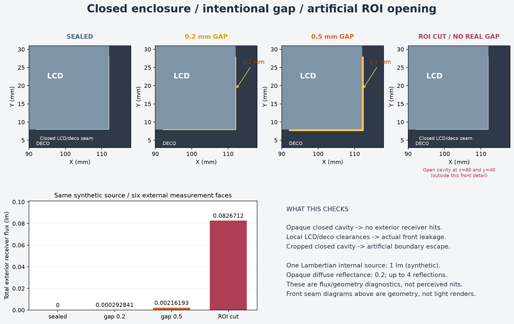

# 완전 차폐 / 코너 틈 / ROI 개방 시험 샘플

사내 CAD 없이 만든 개발용 형상이다. 불투명한 후면·측벽·LCD 경계·전면 데코로 닫힌 공동을 만들고, LCD와 데코 사이에만 의도적으로 L자 틈을 낸다. 현재 시뮬레이터에서 STEP 형상과 BITSAM 설정·저장 결과를 함께 열 수 있다.

**이 샘플은 광선 경로와 수광 검증용이다. 암실 외관 렌더링이나 실제 TV의 1~2 nit 재현 결과는 아니다.**

## 열기

처음에는 틈과 경로가 상대적으로 확인하기 쉬운 `gap_0p5`를 권장한다.

1. 프로그램의 `Import CAD`로 `gap_0p5.step`을 연다.
2. 상단 `Load`로 같은 이름의 `gap_0p5.bitsam`을 연다. BITSAM에는 CAD가 내장되어 있지 않으므로 대응 STEP이 필요하다.
3. 불러온 직후 열리는 `Ray Tracing Analysis Result` 창에서 저장된 수광 결과를 확인한다. `Step 04 Ray Tracing`에서 같은 조건의 CPU 해석도 다시 실행할 수 있다.
4. 카메라 `XY`와 회전·확대를 사용해 오른쪽 아래 코너를 살핀다. 화면의 `Transparency`는 내부 구조 확인용이다.
5. 다른 샘플도 해당 STEP을 먼저 활성화하고 같은 이름의 BITSAM을 불러온다. **기준 비교 중에는 ROI로 형상을 자르거나 부품을 해석에서 제외하지 않는다.**

BITSAM은 기존 프로젝트 생성·읽기·장면 fingerprint 검사 및 workspace 복원 함수를 사용해 만들었다. 모든 부품의 광학 재질과 내부 광원, 외부 Receiver 6개, CPU 해석 조건, 저장된 결과를 포함한다. 처음 로드할 때 프로그램 버전의 호환성 안내가 나타나면 그 내용을 확인한다.

현재 fingerprint는 미세한 틈 폭 차이까지 구별하지 못하며, 두 gap 파일의 fingerprint도 같다. 호환된다는 안내만 믿고 서로 다른 폭의 설정·저장 결과를 섞지 않도록 **파일 이름이 같은 STEP/BITSAM을 반드시 짝지어 사용한다.**

로컬 UI에서 `gap_0p5.step`의 4개 부품 표시, BITSAM 복원 완료, 저장 결과의 20,000 rays·118 hits·CPU 상태를 확인했다. 이때 왼쪽 Step 05의 상태는 `not run`으로 남아 있었지만 별도 결과 창과 3D 경로에는 저장 결과가 표시되었다. 저장 결과 확인은 결과 창을 기준으로 하며, 새 실행 상태가 필요하면 Step 04에서 다시 실행한다. 이 기존 UI 표시 차이는 이번 샘플 작업에서 변경하지 않았다.

앱에서 새로 CPU 해석도 실행해 완료를 확인했다. 앱은 `numba_cpu`를 선택해 같은 20,000 rays에서 **113 hits**를 보고했다. 아래 저장 결과는 생성기가 명시한 `python_cpu`의 **118 hits**다. 서로 다른 실행 경로 사이의 완전한 수치 동등성을 검증한 것은 아니므로 재실행 결과를 저장 결과와 동일하다고 가정하지 않는다. 특히 적은 수광 표본으로 정확한 밝기 비율을 정하지 않는다.

## 파일과 결과

동일한 시험 광원 1 lm, primary ray 20,000개, seed 20260903, 최대 깊이 4, `python_cpu` 기준 계산으로 실행했다. 수광 도달 수는 밝기 단위가 아니며, 광속도 관측 방향의 휘도와 다르다.

| STEP + BITSAM 이름 | 구조 | 외부 도달 수 | 총 수광 광속 |
| --- | --- | ---: | ---: |
| `closed` | 틈 없는 닫힌 공동 | 0 | 0 lm |
| `gap_0p2` | LCD/데코 사이 0.2 mm L자 틈 | 12 | 0.000292841 lm |
| `gap_0p5` | LCD/데코 사이 0.5 mm L자 틈 | 118 | 0.00216193 lm |
| `roi_cut_open_demo` | 닫힌 CAD 일부를 잘라 공기 공동 개방 | 13,152 | 0.0826712 lm |

`roi_cut_open_demo`는 실제 전면 틈이 없다. 그런데 절단부로 빠진 광선 중 일부가 전면 Receiver까지 도달해 전면에서 3,990건, 0.0294106 lm이 수집되었다. 절단부에 Receiver를 두지 않는 방법만으로 가짜 수광을 제거할 수 없음을 보여준다. 이 파일은 **의도적으로 잘못된 축소 경계의 예시**이며, 실제 제품 빛샘으로 해석하면 안 된다. CAD를 Boolean 절단한 파일이므로 현재 UI의 ROI face 선택 알고리즘을 정확히 재현한 것은 아니다.



그림 위쪽의 노란 선은 틈 위치를 표시한 도식이다. 빛샘 렌더링 영상이 아니다.

## 합성 구조와 광학 조건

- 단위 mm. 내부 공동: X 0~120, Y 0~80, Z 0~16. 벽 두께 2.
- LCD 불투명 경계: X 8~112, Y 8~72, Z 16~18. 전면 바깥 방향은 +Z.
- 코너 틈: 아래쪽 X 92~112 부근, Y 8 부근 및 오른쪽 X 112 부근, Y 8~28. 2 mm 전면 두께를 관통한다.
- 내부 광원: 중심 (100, 20, 8), 크기 30×28 mm, +Z 방향 Lambertian 분포, 총 1 lm. 실측 BLU의 배광·스펙트럼·출력을 대체하지 않는다.
- 모든 부품은 불투명 확산 반사율 0.2. LCD도 차폐 경계로 단순화했으며 실제 LCD 투과·산란층은 모델링하지 않았다.
- 바깥 6면 Receiver는 어디로 빠져나가는지 검사하는 측정용 상자다. 광선은 첫 Receiver 도달에서 종료하므로 합산 수광이 같은 경로를 중복 계산하지 않는다. 실제 눈/비전 카메라 배치가 아니다.
- `roi_cut_open_demo`는 X≥80, Y≤40 영역만 남긴다. X=80, Y=40의 공기 공동을 막는 차폐면은 없다.
- 저장 경로는 최대 120개인 진단용 표본이다. 틈 샘플에서 저장된 수광 경로가 의도한 전면 틈을 통과하는지 검사했다. 모든 경로를 증명한 것으로 보지 않는다.
- 기여 통계는 `summary` 모드다. 모든 추적 삼각형의 상세 통계를 저장하는 대신 샘플을 가볍게 유지하며, Receiver 격자·광속과 진단 경로는 보존한다.

## 검증 범위

실제 OCP STEP importer와 정밀 추적 mesh를 사용했으며, 해석 provider는 명시적으로 `python_cpu`였다. 이번 검증은 닫힌 기준 장면의 외부 수광 0, 틈의 수광 발생, 큰 틈에서 이 시험의 수광 증가, 절단 경계의 인위적인 광선 유출을 확인한다.

0.2 mm 샘플은 검출 수가 적다. 현재 수치로 틈 폭에 따른 정확한 밝기 비율을 정하지 않는다. 정량 렌더링으로 확장할 때는 ray 수·반사 깊이·영상 해상도에 대한 수렴 확인과 관측 카메라 계산, 내부 실측 보정이 필요하다. `min_energy=0`은 이 유한 깊이 시험에서 개별 광선 에너지 문턱을 사용하지 않는다는 뜻이며, 육안 미광 표시 문턱이 아니다.

`*.scene.json`, `*.request.json`, `*.result.json`은 생성·검증의 중간 자료이고, `validation.json`에 요약을 기록했다. 파일의 scene token은 생성 프로세스의 캐시 식별자이므로 다른 서버 세션에서 그대로 API 요청을 재생하지 않는다. BITSAM을 로드하면 현재 가져온 CAD 장면을 사용한다.

## 재생성

저장소 의존성이 준비된 Python에서 다음을 실행한다. GPU 설정이나 설치는 필요하지 않다.

```powershell
python scripts/generate_closed_enclosure_samples.py --rays 20000
```

Node.js 24 이상과 설치된 frontend 의존성으로 네 BITSAM을 만든다.

```powershell
foreach ($caseName in @('closed', 'gap_0p2', 'gap_0p5', 'roi_cut_open_demo')) {
  node scripts/closed_enclosure_project_helper.mjs --scene "samples/closed_enclosure/$caseName.scene.json" --request "samples/closed_enclosure/$caseName.request.json" --result "samples/closed_enclosure/$caseName.result.json" --cad-name "$caseName.step" --output "samples/closed_enclosure/$caseName.bitsam"
}
```

기존 출력 폴더의 같은 이름 생성 파일을 갱신한다. 별도로 보존하려면 Python의 `--output`을 다른 폴더로 지정하고 Node 입력·출력도 같은 폴더로 맞춘다.

## 개발용 빛샘 출구 데이터

기존 결과에서 3D 표시용 출구 표본만 추출하려면 다음을 실행한다. Ray Tracing은 다시 실행하지 않는다.

```powershell
python scripts/extract_closed_enclosure_leakage_samples.py
```

`leakage_preview_samples.json`에 실제 틈의 출구점, 진행 방향, 원래 광선의 상대 가중치와 경로 식별자를 저장한다. 이 합성 형상의 알려진 외면과 틈을 이용하는 방법이므로 일반 CAD의 출구 자동 검출 기능은 아니다. 닫힌 샘플 0개, 0.2 mm 틈 12개, 0.5 mm 틈 118개를 추출해 틈 내부 여부와 방향·좌표를 검사했다. 저장 경로는 제한된 수광 우선 표본이므로 전체 광량, 정확한 면적, nit 또는 모든 관측 방향을 재구성하는 데이터로 해석하지 않는다. 이 개발용 JSON은 STEP/BITSAM 배포 ZIP에 포함하지 않는다.
